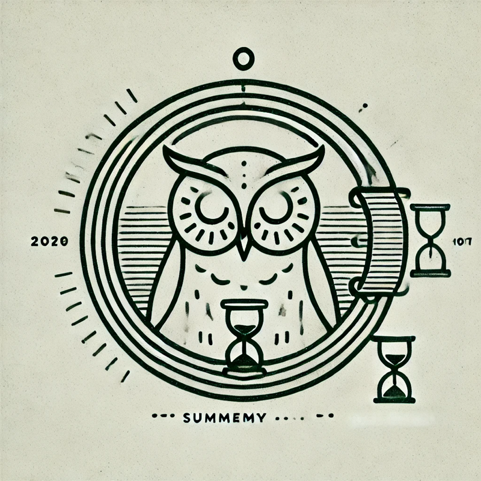

 

<h3 align="center">Yearself</h3>

  AI 驱动的年终总结生成器，支持 OpenAI 语法
   

<!-- 关于项目 -->
## 关于项目

Yearself 是一个基于 AI 的年终总结生成工具。它能够帮助你快速生成个性化的年终总结，支持多种文风，包括鲁迅、张爱玲、王小波等风格。

主要特点:
- 🤖 基于 OpenAI API 生成内容
- 📝 支持多种文学家风格
- 💾 自动保存功能
- 📱 响应式设计
- ✨ 简洁优雅的界面

### 技术栈

* [Next.js](https://nextjs.org/)
* [React](https://reactjs.org/)
* [TypeScript](https://www.typescriptlang.org/)
* [Tailwind CSS](https://tailwindcss.com/)
* [BlockNote](https://www.blocknotejs.org/)
* [T3 Stack](https://create.t3.gg/)

## 快速开始

### 环境要求

* Node.js 16.8 或更高版本
* pnpm 8.0 或更高版本

### 安装步骤

1. 克隆仓库